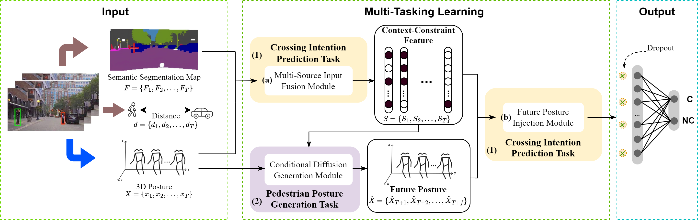
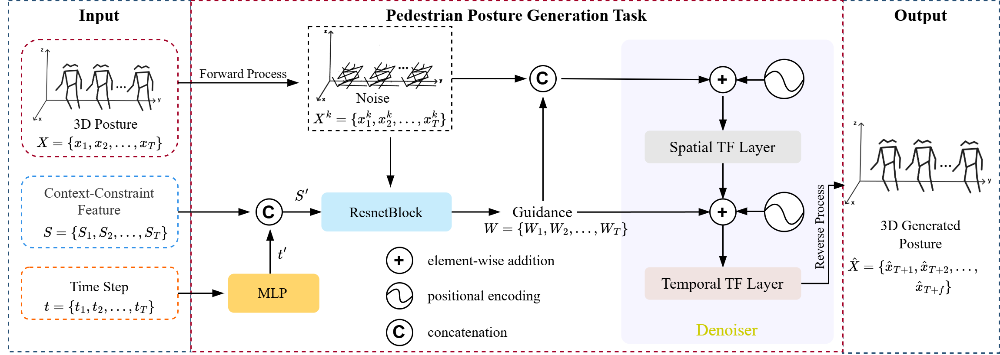
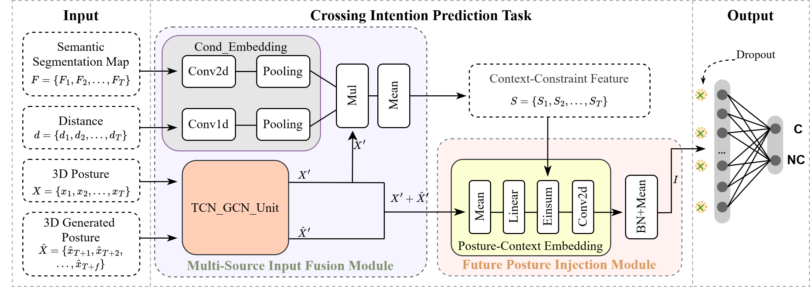

# MTMGN
Explainable Pedestrian Crossing Intention Prediction Based On Multi-Task Mutual Guidance Network.
## Introduction

    
     
    
Overview of MTMGN.

    
     
    
Model architecture of pedestrian posture generation task.

    
     
    
Model structure of crossing intention prediction task.

## Results

    
     
    

## Citation
